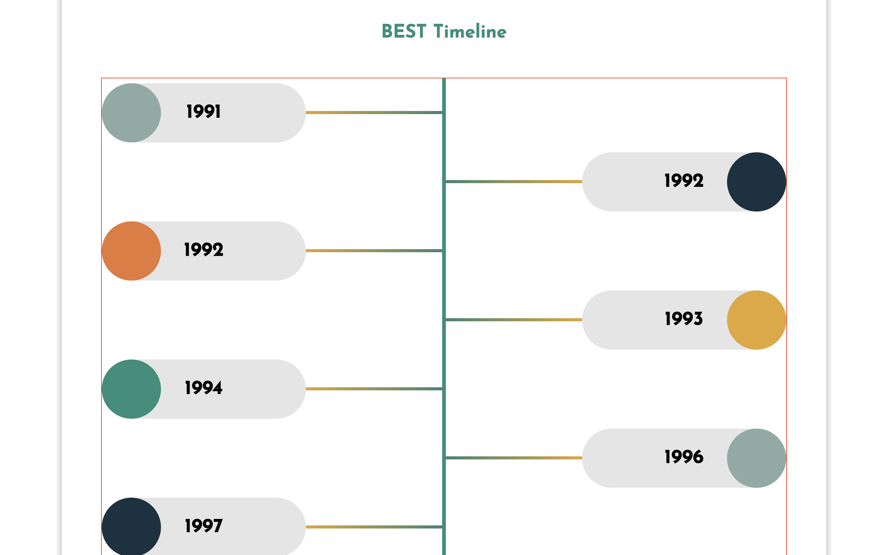
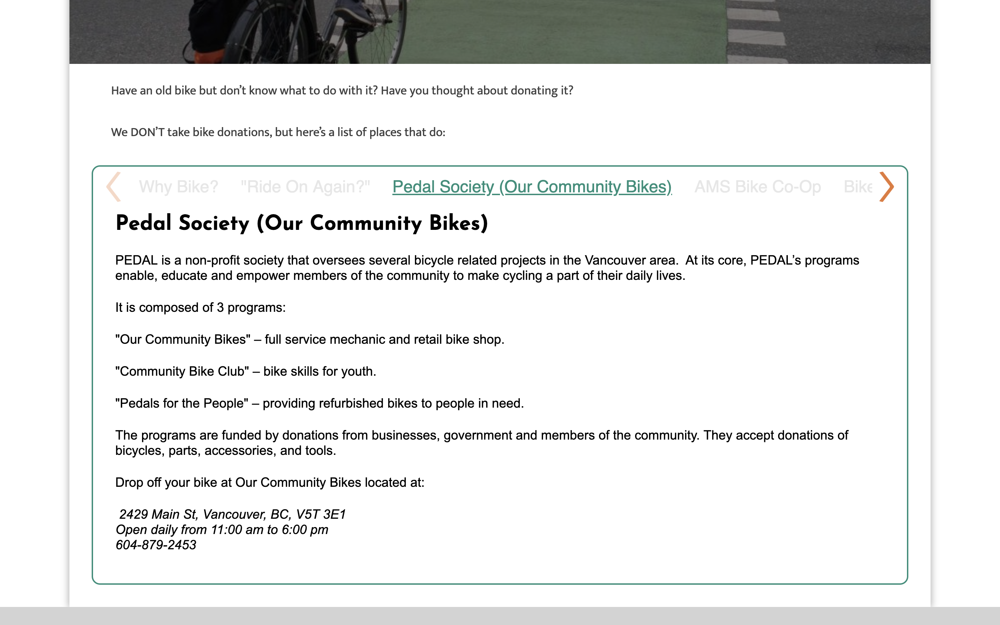

# Best Project 
 A community group project creating a new website for for "Better Environmentally Sound Transportation", a non-profit organization with a long history of promoting sustainable transportation in Vancouver, BC. The project began through a UX and UI design process, researching who the target users were and what they would need to find the site useful for their needs. 
 
 After an extensive research and design process, the client and developers were introduced to the new model in a presentation at RED Academy. The site was then created according to design. It is formatted to view in mobile and desktop. The webite is created from scratch we created our own custom themes by forking a WordPress template. 

 ## Tools and Techs
 * Gulp
 * Wordpress
 * Javascript
 * JQuery
 * PHP
 * HTML
 * Scss
 * Flickity
 * Git and GitHub
 * Command-line
 * Plugins
 * Transfonter
 * Forms 

 # Features

 ## History Page Timeline

The unique timeline was one of the most difficult part of the project, displaying an interactive timeline highlighting BEST's history (and have the timeline updatable by the client). Each year has a popup when clicked describing a milestone for that year. 

The timeline's expanding branch design required heavy CSS and JavaScript to achieve its final form. The timeline appears only in the History Page. 

 
 ## Programs Page

 

 In the Programs Page, six programs are displayed in grid which contains image and title. On hover in each program displays out brief info regarding the specific program with a button linked to visit external site. 
 
 
 ## Tabs

 

Tabs can be seen through-out the Resources, Achivements and Get Involved pages. These required custom fields and are easily updatable by the client. Each section, when clicked, highlights a different area that BEST supports, runs, or can refer users to.

 # Learnings
  This project was challenging as our first group project requiring extensive teamwork, coordination in planning, and strategizing. Git version control introduced merge conflicts often and we learned alot with each resolution process. 
  Creating the timeline was a unique challenge as it was created by design, and implementing the design while making it functional required some creativity. Custom field suites were also new to many of us, specifically how to use PHP to ensure the data is updatable by the end user without having to access the site's code.  

## Group Members
* Vincent [Link](https://github.com/a36168120)
* Jeff [link](https://github.com/Penner77)
* Tenzin [link](https://github.com/tenzyy)
* Rishab [link](https://github.com/rishabagrawal)
